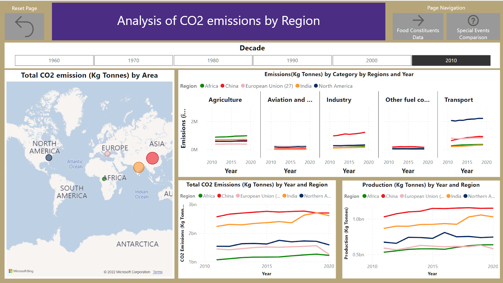
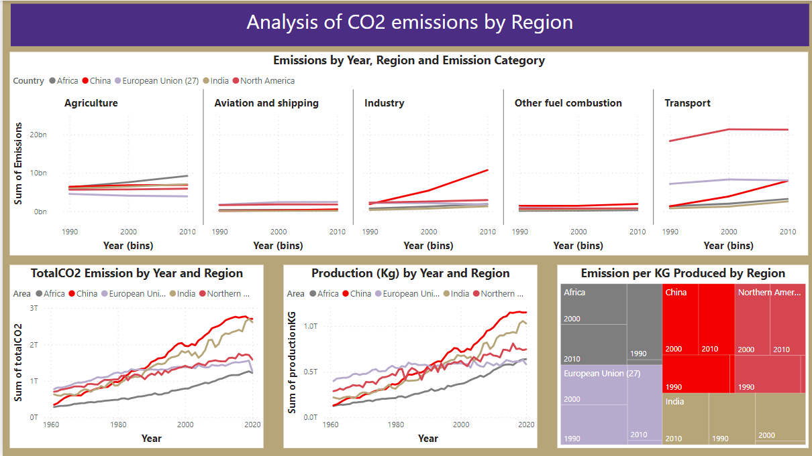
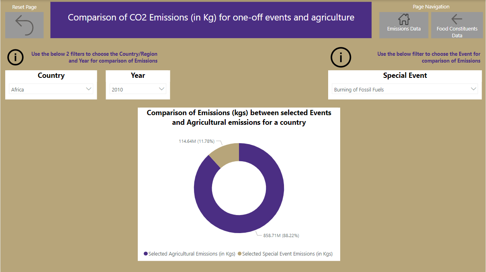
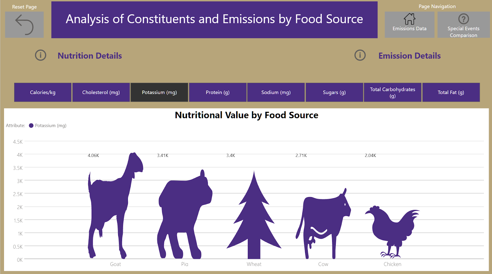

# Data511FP - Final project for data 511 - Interactive Dashboard

Our interactive dashboard outlines the environmental impacts of food production through a comparative analysis of cost, nutritional value and emissions of different constituent of food.

Dashboard - https://app.powerbi.com/groups/me/reports/6be9567e-14e6-44de-833c-668fc6fb5836/ReportSection707dbe840ad5e6c4279d

# Reference images from dashboard:

# Reference image from brainstorm/FSD activity:

We came up with this idea because we all believe that being educated on food affordability, healthy diets, and climate change matters. Although this visualization is helpful for the general public, it will be more relevant for environmental protection agencies, government officials, major event organizers (such as world cups or the Olympics) and agriculturalists. Our goals in this work were to find various facts about climate emissions when related to food production and report them to our audience. To accomplish this, we had to research, explore, refine, clean, and fuse many different datasets to be able to craft specific visualizations for our dashboard. As a team, we believe that telling stories about the environmental impact of food, its’ affordability, and the production is important for various reasons. First, food affordability is a key indicator of food choice and access, which in turn drives dietary patterns, food production, and health. Next, climate change has been an ongoing yet slow crisis. Sources show that in the next one-hundred years, given the current global emission trajectory, the earth will have an increased average temperature, the sea level will rise, the oceans will be more acidic, ecosystems will morph, and precipitation patterns will change. Thus, it would be beneficial if we could quantify the role of emissions from food production in climate change. Finally, we believe that exploring the production of various foods is important as we can pinpoint who is responsible for the world’s production of foods, why they make specific foods, and what the diets of various geographical locations are. Given these reasons, our stance is that all people should have access to information about their diets, and be able to understand the impact their diets have on both themselves and the rest of the population. While it’s straightforward that our audience is the set of all people who consume food, through various personal perspectives, we specifically wanted our stories to be told from a point of view of three main consumer types: Meat eaters, vegetarians and vegans and, those somewhere in-between, as we were of the prior impression that meat-based diets are objectively worse for both the environment and personal health.

Given this background, our goals for this project were the following –
1) Analyze diets from a cost point of view
2) Analyze diets from a nutritional point of view
3) Examine the greenhouse gas emissions of various geographical regions both historically and currently, and draw upon observations to compare/contrast the environmental impact of food production with other less-reported sources of emissions, like private flights that sports teams take.

