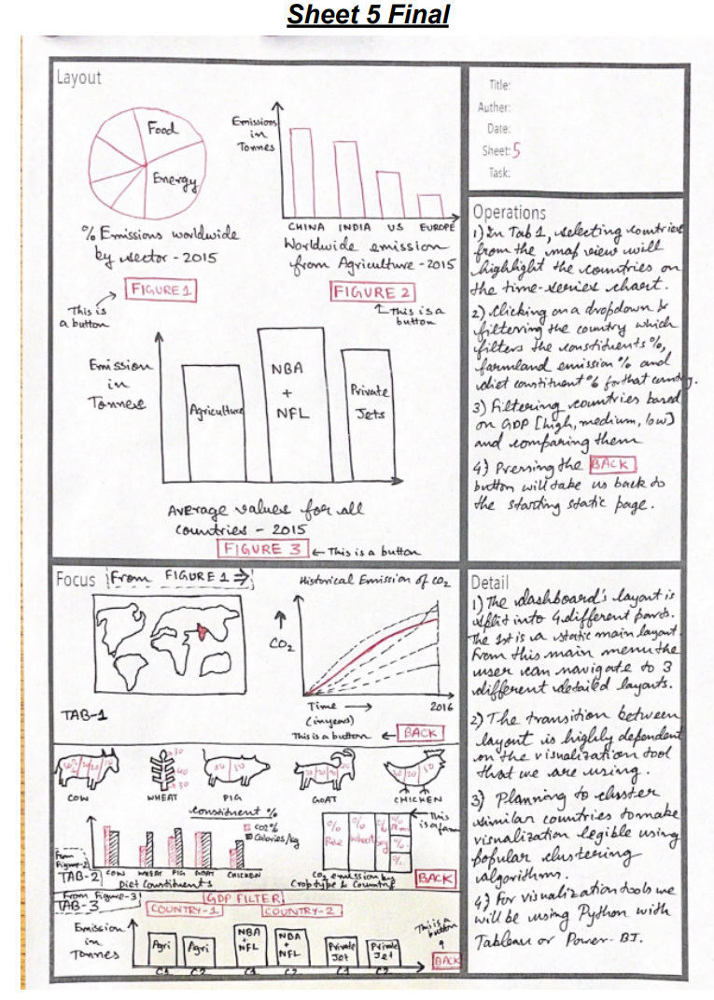

# Data511FP - Final project for data 511 - Interactive Dashboard

# Link to hosted dashboard here:

# Dashboard explained: 
--------------------------------------------------------------------------------
## __Static tab__
### Visualization 1
* Main Story Point - ()? 
* % Emissions worldwide by sector 
* Pie chart
* Energy, food production, etc. (Which ever ones contribute most!)
### Visualization 2
* Main Story Point - ()? 
* Worldwide Emissions from Agriculture - 2015?
* Bar chart
* China, India, US, Europe?
### Visualization 3
* Main Story Point - ()? 
* Emissions in tons for specific areas - Averages over all countries in 2015
* Bar chart
* Agriculture, professional sports teams, Private jets, etc.
--------------------------------------------------------------------------------
## __Interactive tab 1__
### Visualization 1
* Main Story Point - ()? 
* 
* World map
* 
### Visualization 2
* Main Story Point - ()? 
* Historical emission of CO2 for all countries ???-2016
* Time series 
--------------------------------------------------------------------------------
## __Interactive tab 2__
### Visualization 1
* Main Story Point - ()? 
* ?
* Animal picture slices
* ?
### Visualization 2
* Dual bar chart
### Visualization 3
* area chart
--------------------------------------------------------------------------------
## __Interactive tab 3__
### Visualization 1
* Bar chart
--------------------------------------------------------------------------------
## __Operations:__
* Static tab (Tab0):
    *  Visualization1
    *  Visualization2
    *  Visualization3
* Interactive tab1 
    *  Visualization1 - Clicking on a specific country highlights it red (Triggers vis2 interaction)
    *  Visualization2 - Clicking on a specific line (country) highlights it red (Triggers vis1 interaction)
* Interactive tab2
    *  Visualization1
    *  Visualization2
    *  Visualization3
* Interactive tab3
    *  Visualization1

***

# Datasets:
https://ourworldindata.org/emissions-by-sector#annual-greenhouse-gas-emissions-by-sector
(Tab0 Visualization2) Dont have 'food' specific for tab0 vis1

https://www.kaggle.com/datasets/vagifa/meatconsumptionLinks - Consumption of Beef, Pig, Poultry, Sheep from 1991-2026 in 48 countries

https://www.kaggle.com/datasets/selfvivek/environment-impact-of-food-production - Greenhouse gas emissions of various farm products (wheat, eggs, etc.)
(Tab2 Visualization3)

https://ourworldindata.org/agricultural-production - Crop production from 1961-2020
(Tab2 Visualization3)

https://ourworldindata.org/meat-production - Meat production from 1961-2020

https://ourworldindata.org/fish-and-overfishing  - Fish production from 1961-2020  

https://ourworldindata.org/co2-emissions - CO2 emissions per country 1750-2021 
(Tab1-Visualization1, Tab1-Visualization2)

https://www.kaggle.com/datasets/shrutisaxena/food-nutrition-dataset - Consituent for each type of food

https://essd.copernicus.org/preprints/essd-2021-228/essd-2021-228.pdf ????

https://stats.oecd.org/BrandedView.aspx?oecd_bv_id=env-data-en&doi=data-00735-en Massive CO2 dataset

https://corgis-edu.github.io/corgis/csv/food/ Food Constituents Dataset

https://corgis-edu.github.io/corgis/csv/emissions/ Emissions based on Power, Travel, Building and other sectors

# Tools used:
Python  v ???  
Tableau Prep Builder  ??  
Tableau Desktop ??  
Microsoft PowerBI ???  
..  
..  
..    

# Reference image from brainstorm/FSD activity:

